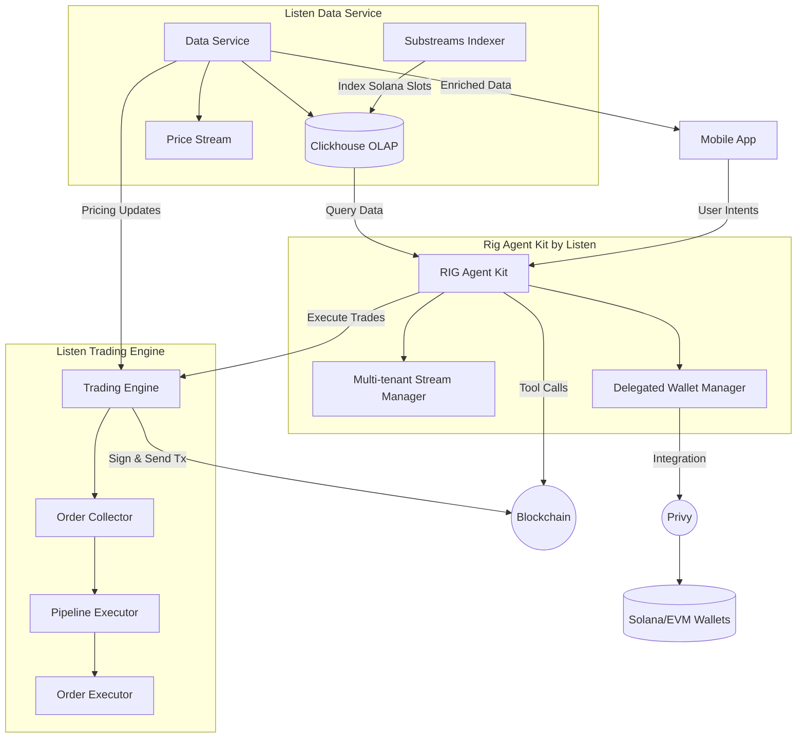

<p align="center">

<br />
</p>
<p align="center">
<a href="https://docs.listen-rs.com/"></a> &nbsp;
<a href="https://github.com/piotrostr/listen"></a>
<a href=""></a>
</p>

<p align="center">
<code>listen</code> started sa Solana Swiss-Knife toolkit for algorithmic trading, its mission is to become the go-to framework for AI portfolio management agents
</p>

## Listen Architecture



## Features

- 🔍 Real-time transaction monitoring
- 💱 Multi-DEX swap execution (Pump.fun, Jupiter V6 API or Raydium)
- 🚀 Blazingly fast transactions thanks to Jito MEV bundles
- 📊 Price tracking and metrics
- 🧰 Token management utilities
- 📈 Performance monitoring with Prometheus integration

And more!

It works plug'n'play with [$arc rig
framework](https://github.com/0xPlaygrounds/rig) framework allowing AI Agents
interact with the Solana blockchain, see example:
[src/agent.rs](https://github.com/piotrostr/listen/blob/main/src/agent.rs) and
the output [image](https://github.com/piotrostr/listen/blob/main/example.png).

For complete rundown of features, check out the CLI output of `cargo run` or the
[documentation](https://docs.listen-rs.com/).

## Quickstart

To play around with listen-rs, you can use the UI

Fill in the `.env.example` and `./dashboard/.env.example`, copy over to `.env` and `./dashboard/.env.example`, then

```
docker compose up
```

You can then access the dashboard over `http://localhost:4173`

> [!WARNING]
> listen-rs is undergoing rapid iterations, some things might not work and there could be breaking changes

## Requirements

1. **System Dependencies**

   - Rust (with nightly toolchain)
   - `protoc`
   - `build-essential`
   - `pkg-config`
   - `libssl-dev`

2. **Configuration**
   - Copy `.env.example` to `.env`
   - Set up `auth.json` for JITO authentication (optional, gRPC HTTP/2.0 searcher client)
   - Populate `fund.json`

Both keypairs are in `solana-keygen` format, array of 64 bytes, 32 bytes
private key and 32 bytes public key.

## Quick Start

```bash
# Install dependencies
sudo apt install protoc build-essential pkg-config libssl-dev

# Build
cargo build --release

# Run services
./run-systemd-services.sh
```

## Usage Examples

### Transaction Monitoring

```bash
cargo run -- listen \
  --worker-count [COUNT] \
  --buffer-size [SIZE]
```

### Token Swapping

```bash
cargo run -- swap \
  --input-mint sol \
  --output-mint EPjFWdd5AufqSSqeM2qN1xzybapC8G4wEGGkZwyTDt1v \
  --amount 10000000
```

> [!WARNING]
> Default configuration is set for mainnet with small transactions. Ensure proper configuration for testnet usage and carefully review code before execution.

## Metrics and Monitoring

Listen includes built-in metrics exposed at `localhost:3030/metrics`. To visualize:

1. Start Prometheus:

```bash
prometheus --config=prometheus.yml
```

2. Access metrics at `localhost:3030/metrics`

Grafana should show something like this


## Advanced Usage

### Swap Profiling

The `stackcollapse.pl` can be installed through

```sh
gh repo clone brendangregg/FlameGraph && \
  sudo cp FlameGraph/stackcollapse.pl /usr/local/bin && \
  sudo cp FlameGraph/flamegraph.pl /usr/local/bin
```

Profile swap performance using DTrace to produce a flamegraph:

```bash
./hack/profile-swap.sh
```


